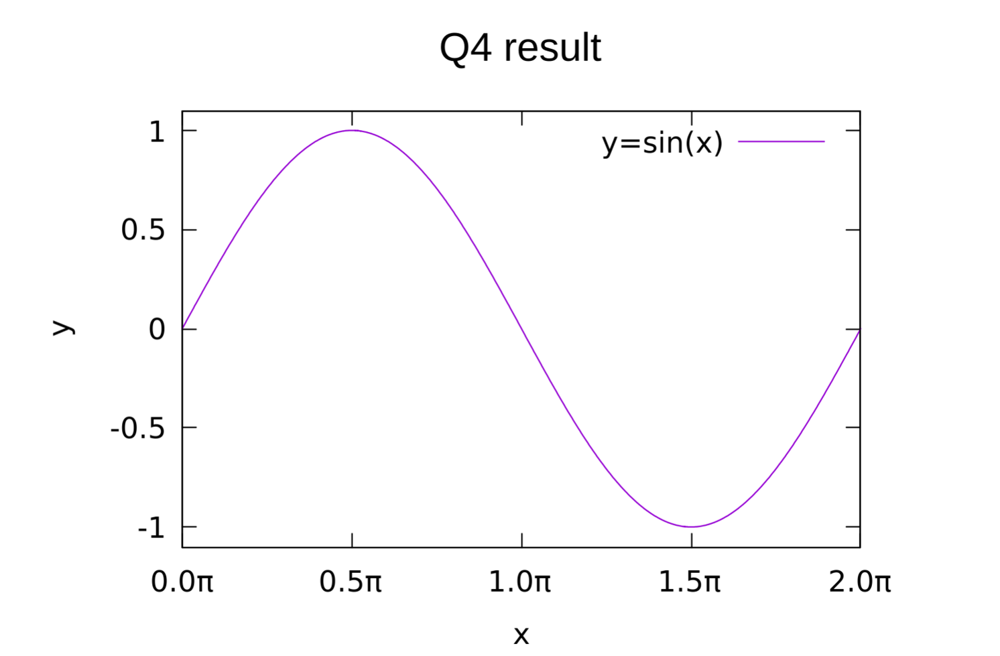

# 問4 ファイル出力・グラフの作成
$y=f(x)=\sin{(x)}$の$x$の値を区間$[0, 2\pi]$の範囲でテキストファイルで出力する。

また、そのファイルをgnuplotでレンダリングして、Markdownにスクリーンショットを載せる。

---

## main.c

```C
#include <stdio.h>
#include <math.h>
#define X_MIN 0.0
#define X_MAX 2.0*M_PI
#define N 1000
    
int main(void)
{
    FILE *gp, *file;
    char *file_name;
    double x, y, d;
    file_name = "data.dat";
    file = fopen(file_name, "w");
    
    d = (X_MAX-X_MIN)/N;
    for(int i=0; i<=N; i++)
    {
        x = X_MIN + i*d;
        y = sin(x);
        fprintf(file, "%f\t%f\n", x, y);
    }
    fclose(file);
    
    gp = popen("gnuplot -persist", "w");
    fprintf(gp, "set title \"Q4 result\"\n");
    fprintf(gp, "set title font\"Arial,12\"\n");
    fprintf(gp, "set xlabel \"x\"\n");
    fprintf(gp, "set xrange [%f:%f]\n", X_MIN, X_MAX);
    fprintf(gp, "set xtics %f\n", (X_MAX-X_MIN)/4);
    fprintf(gp, "set format x \"%2.1P{/Symbol p}\"\n");
    fprintf(gp, "set ylabel \"y\"\n");
    fprintf(gp, "set yrange [-1.1:1.1]\n");
    fprintf(gp, "set ytics 0.5\n");
    /*fprintf(gp, "set format y \"%2.1f\"\n");*/
    fprintf(gp, "plot \"%s\" with lines linetype 1 title \"y=sin(x)\"\n", file_name);
    
    pclose(gp);
    
    return 0;
}
```
---
## 出力結果

[](./image/result.png)

---
- [問1へ](https://github.com/Kouji-Tanaka/B4_Programming1 "Kouji-Tanaka/B4_Programming1")
- [問2へ](https://github.com/Kouji-Tanaka/B4_Programming2 "Kouji-Tanaka/B4_Programming2")
- [問3へ](https://github.com/Kouji-Tanaka/B4_Programming3 "Kouji-Tanaka/B4_Programming3")
- [問5へ](https://github.com/Kouji-Tanaka/B4_Programming5 "Kouji-Tanaka/B4_Programming5")
- [問6へ](https://github.com/Kouji-Tanaka/B4_Programming6 "Kouji-Tanaka/B4_Programming6")

<div>
    <a href="#">
        [Topへ]
    </a>
</div>
